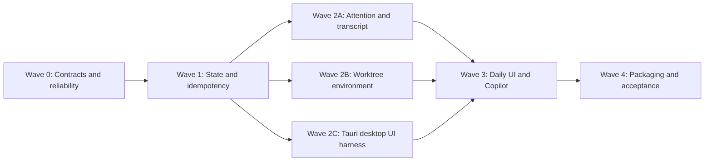

# Coolie 0.1.0 Implementation Roadmap

> 日期：2026-07-15  
> 状态：Ready for execution  
> 产品需求：[`../specs/2026-07-15-coolie-v0.1.0-prd.md`](../specs/2026-07-15-coolie-v0.1.0-prd.md)  
> 原则：每个 task 必须可在一个 focused session 内实现、验证和提交。

## 1. 执行规则

### 1.1 Task 完成标准

每个 task 完成时必须：

- 满足全部 acceptance criteria；
- 运行指定 verification；
- 不触碰真实 `~/.coolie`、`~/.claude`、`~/.codex`；
- 不扩大 PRD 范围；
- 更新对应 contract/test，而不是只改实现；
- 保持 workspace clean 或仅包含当前 task 的预期 diff。

### 1.2 尺寸

- **S**：1–2 个 production files，加对应测试。
- **M**：3–5 个 production files，加对应测试。
- 超过 5 个独立 production files 时继续拆分。

### 1.3 Gate

```text
Fast gate
  bun run typecheck
  bun run test:fast

Runtime gate
  bun run test:runtime

Desktop UI gate
  bun run test:tauri

Release gate
  bun run release:verify
```

脚本名称由 Wave 0 建立；建立前使用现有等价命令。

### 1.4 多任务 / 多 worktree 执行协议

0.1.0 实现必须由 Coolie 自己管理的多任务、多 worktree 执行，不允许多个 worker 直接修改 main checkout。

1. 开工前把本 PRD、roadmap 和 decision log 提交成干净 baseline；当前 main checkout 必须 clean。
2. 每个 roadmap Task 创建一个独立 Coolie workspace/worktree 和 branch；Task id 写入 workspace prompt、commit 和验收记录。
3. 同一 Wave 中没有依赖、且不修改同一 contract/migration 的 Task 可并行；protocol、migration 和 shared registry 先串行落地。
4. Worker 只在自己的 worktree 修改、测试和提交，不执行 main merge、不删除其他 worktree、不使用 `git reset --hard`。
5. Worker 完成后通过 `coolie collect <taskId>` 提交 diff、测试、风险和剩余事项；状态改为 `in_review`。
6. Controller 在该 worktree 完成代码 review 和 Task acceptance，失败则把具体问题发回原 task 修复。
7. 验收通过后，唯一 integrator 在 clean 的当前 main 上串行执行 `coolie finish <taskId> --merge-back`；冲突时停止并保留现场，不自动 reset。
8. 每合入一个 Task 运行受影响 gate；每个 Checkpoint 完成后运行该 Wave 的全量 gate，再 archive 已合入 workspace。
9. 未通过验收的 branch/worktree 保持隔离，不得为了“让 main 先前进”而部分 cherry-pick 未验收代码。

所有架构和执行策略变更记录到 [`docs/architecture-decision-log.md`](../../architecture-decision-log.md)。

## 2. 依赖图



可并行：

- Wave 2A、2B、2C 在 Wave 1 contract 合入后并行。
- Wave 2A 内 Claude transcript UI 与 attention client 在 server contracts 固定后并行。
- Wave 2C Tauri mock-daemon journeys 与 real fixture 可由不同 worktree 并行。

必须串行：

- migration → repository → HTTP/CLI → UI。
- transcript protocol → Claude vertical slice → Codex parser。
- sidecar ADR → packaging implementation → clean artifact smoke。

---

# Wave 0 — Contracts、可靠性与发行技术选型

目标：先消除会污染后续 E2E 的已知半状态和测试不稳定，并确定发行架构。

## Task 0.1：建立测试分轨与统一隔离 fixture

**Description**

把现有单一 `vitest run` 拆为 fast 与真实 runtime 两轨，统一临时 home、tmux socket、port 和 teardown。

**Acceptance criteria**

- [ ] fast track 不启动真实 tmux/git daemon。
- [ ] runtime track 使用唯一 `COOLIE_TMUX_SOCKET` 且限制 worker。
- [ ] teardown 后无 test tmux server、daemon process 或临时 worktree。

**Verification**

- [ ] 连续运行 fast 3 次全绿。
- [ ] 连续运行 runtime 3 次全绿。

**Likely files**

- `package.json`
- `vitest.config.ts`
- `packages/server/test/helpers/runtime-env.ts`
- `packages/cli/test/helpers/runtime-env.ts`

**Dependencies**：None  
**Scope**：M

## Task 0.2：修复 terminal reconnect 旧 WebSocket 泄漏

**Description**

`TermSession.reconnect()` 必须关闭并等待旧连接终止，再创建新连接；旧 generation 事件不得写入新 xterm。

**Acceptance criteria**

- [ ] 同一 session 同时最多一个 active socket。
- [ ] 旧 socket 的 late message/close 不改变新连接状态。
- [ ] Resume 连续点击幂等。

**Verification**

- [ ] `packages/client/test/terminal-session-registry.test.ts`
- [ ] 新增真实 mock WS reconnect test。

**Likely files**

- `packages/client/src/terminal/session.ts`
- `packages/client/test/terminal-session-registry.test.ts`
- `packages/client/test/terminal-resume.test.ts`

**Dependencies**：None  
**Scope**：S

## Task 0.3：为 archive 引入可恢复状态

**Description**

消除“tmux 已拆、最终 dirty guard 失败但 workspace 仍 active”的窗口。新增 `archiving` 或等价持久 phase，并定义补偿。

**Acceptance criteria**

- [ ] archive freeze 输入后再做最终 dirty check。
- [ ] 任一步失败后可 retry，或恢复到完整 active runtime。
- [ ] adopted workspace 不删除外部路径。

**Verification**

- [ ] 故障注入：kill session 后 dirty guard 失败。
- [ ] daemon restart 恢复 archiving。
- [ ] existing archive/unarchive lifecycle tests 全绿。

**Likely files**

- `packages/protocol/src/domain.ts`
- `packages/server/src/workspace/lifecycle.ts`
- `packages/server/src/repo/workspaces.ts`
- `packages/server/test/lifecycle-archive.test.ts`

**Dependencies**：None  
**Scope**：M

## Task 0.4：明确 queue at-least-once 契约

**Description**

先把 crash-after-delivery-before-delete 语义写入 protocol/CLI 文档和测试，禁止后续实现误称 exactly-once。

**Acceptance criteria**

- [ ] queue DTO/CLI help 明示 at-least-once。
- [ ] 测试覆盖已投递但 receipt 未提交的恢复重投窗口。
- [ ] event payload 带 queue/message identity。

**Verification**

- [ ] `packages/server/test/engine.queue-drain.test.ts`
- [ ] `packages/cli/test/schema-contract.test.ts`

**Likely files**

- `packages/protocol/src/routes.ts`
- `packages/server/src/engine/queue-drain.ts`
- `packages/server/test/engine.queue-drain.test.ts`

**Dependencies**：None  
**Scope**：S

## Task 0.5：Tauri CSP 与 command allowlist

**Description**

启用 CSP，并把任意 `spawn_detached(program,args)` 收窄为 server、external terminal、editor 等专用 command。

**Acceptance criteria**

- [ ] release config 不再 `csp:null`。
- [ ] renderer 不能请求任意 executable。
- [ ] 现有 editor/external terminal 功能保持 argv-only。

**Verification**

- [ ] Rust unit tests 覆盖 allow/deny。
- [ ] desktop frontend build。

**Likely files**

- `packages/client/src-tauri/tauri.conf.json`
- `packages/client/src-tauri/src/main.rs`
- `packages/client/src/platform.ts`
- `packages/client/src/api/discovery.ts`

**Dependencies**：None  
**Scope**：M

## Task 0.6：完成 daemon sidecar ADR spike

**Description**

比较并实测两条 Node runtime 发行路径：

1. 随包 Node runtime + compiled JS/resources/native addons；
2. 可验证的 standalone Node packaging。

不得使用 Bun 运行 `node-pty` server。

**Acceptance criteria**

- [ ] 两个 PoC 都在无 repo `node_modules` 环境启动 `/health`。
- [ ] ADR 记录大小、启动耗时、native addon、更新和调试取舍。
- [ ] 选定 Wave 4 实施路径并列出 exact bundle manifest。

**Verification**

- [ ] 临时目录 clean-room smoke。
- [ ] `node-pty` terminal attach 和 `better-sqlite3` open 冒烟。

**Likely files**

- `docs/superpowers/adr/2026-07-xx-server-sidecar.md`
- `packages/server/scripts/build-sidecar.ts`
- `packages/client/src-tauri/tauri.sidecar-spike.conf.json`

**Dependencies**：None  
**Scope**：M（timeboxed）

## Checkpoint 0

- [ ] Fast/runtime tests 可重复。
- [ ] Archive 与 reconnect 已无已知 P1。
- [ ] Tauri 执行面已收窄。
- [ ] Sidecar ADR 已选型。

---

# Wave 1 — Current State、Typed API 与重试幂等

目标：让 GUI、CLI、agent 都能无竞态获取 current state，并安全重试 mutation。

## Task 1.1：定义 State Snapshot protocol

**Description**

新增 `CoolieStateSnapshot` 及显式 decoder，包含 `asOfSeq` 与 canonical current resources。

**Acceptance criteria**

- [ ] DTO 覆盖 projects/workspaces/tabs/open attention/queue/runs。
- [ ] decoder 拒绝非法 current state。
- [ ] route schema 使用显式 request/response，不从 description 推导。

**Verification**

- [ ] protocol typecheck。
- [ ] protocol contract tests。

**Likely files**

- `packages/protocol/src/state.ts`
- `packages/protocol/src/index.ts`
- `packages/protocol/src/routes.ts`
- `packages/protocol/test/state.test.ts`

**Dependencies**：Checkpoint 0  
**Scope**：M

## Task 1.2：实现 SQLite StateSnapshot module

**Description**

在一个 SQLite read transaction 内读取 `MAX(events.seq)` 和 canonical resources。

**Acceptance criteria**

- [ ] `asOfSeq` 与返回资源来自同一 read transaction。
- [ ] workspace scope 不泄漏其他 workspace queue/attention。
- [ ] 空数据库返回合法空 snapshot。

**Verification**

- [ ] transaction race test：并发 mutation 不产生混合 snapshot。
- [ ] large fixture 有 bounded query 数。

**Likely files**

- `packages/server/src/repo/state.ts`
- `packages/server/src/db/sqlite.ts`
- `packages/server/test/state-repo.test.ts`

**Dependencies**：Task 1.1  
**Scope**：S

## Task 1.3：增加 `/state` 与 `coolie state`

**Description**

暴露 snapshot endpoint 和 JSON CLI。

**Acceptance criteria**

- [ ] `GET /state` 与 `?workspace=` 鉴权、校验和错误码一致。
- [ ] CLI stdout 为稳定 JSON。
- [ ] 文档演示 snapshot→SSE after 流程。

**Verification**

- [ ] `packages/server/test/http-state.test.ts`
- [ ] `packages/cli/test/agent-api.test.ts`

**Likely files**

- `packages/server/src/http/state.ts`
- `packages/server/src/http/app.ts`
- `packages/cli/src/main.ts`
- `packages/cli/src/client.ts`

**Dependencies**：Task 1.2  
**Scope**：M

## Task 1.4：建立 Input Receipt repository

**Description**

新增 idempotency receipt migration/repository，处理 same-key replay 和 hash conflict。

**Acceptance criteria**

- [ ] 同 workspace/key/body 返回首次 response。
- [ ] 同 key 不同 body 为 409。
- [ ] receipt 有 TTL cleanup，key/body size 有上限。

**Verification**

- [ ] transaction/crash/restart tests。
- [ ] workspace 隔离测试。

**Likely files**

- `packages/server/src/db/migrations.ts`
- `packages/server/src/repo/input-receipts.ts`
- `packages/server/test/input-receipts.test.ts`

**Dependencies**：Checkpoint 0  
**Scope**：S

## Task 1.5：接入 idempotent input 与 CLI

**Description**

`POST /workspaces/:id/input` 和 `coolie send` 接受 idempotency key。

**Acceptance criteria**

- [ ] durable enqueue 和 confirmed delivery 保存 receipt。
- [ ] timeout 后相同 retry 不产生第二个 queue item。
- [ ] CLI 自动生成 key 或允许 caller 指定。

**Verification**

- [ ] HTTP duplicate-send test。
- [ ] daemon restart CLI E2E。

**Likely files**

- `packages/server/src/http/app.ts`
- `packages/server/src/repo/queue.ts`
- `packages/cli/src/main.ts`
- `packages/server/test/http-input-idempotency.test.ts`

**Dependencies**：Task 1.4  
**Scope**：M

## Task 1.6：补齐 agent-facing route/verb schema

**Description**

把真实 route、request/response、errors、idempotency、examples 收敛到单一 registry，修复现有 route 漂移。

**Acceptance criteria**

- [ ] 所有 handler route 都被 schema 覆盖。
- [ ] schema 不存在无 handler 的 ghost route。
- [ ] `coolie api schema --json` 可供 agent 直接解析。

**Verification**

- [ ] route parity contract test。
- [ ] unknown field/verb rejection test。

**Likely files**

- `packages/protocol/src/routes.ts`
- `packages/cli/src/schema.ts`
- `packages/protocol/test/routes-contract.test.ts`
- `packages/cli/test/schema-contract.test.ts`

**Dependencies**：Task 1.1  
**Scope**：M

## Task 1.7：实现 `coolie wait`

**Description**

提供基于 snapshot + event cursor 的 timeout-aware wait，不轮询 last-value memory。

**Acceptance criteria**

- [ ] 支持 attention/idle/error。
- [ ] 先 snapshot 后订阅，不丢 snapshot 与 stream 间事件。
- [ ] timeout、daemon restart 和 abort 返回稳定 exit code。

**Verification**

- [ ] event-before-subscribe race。
- [ ] reconnect-after-seq E2E。

**Likely files**

- `packages/cli/src/wait.ts`
- `packages/cli/src/main.ts`
- `packages/cli/test/wait.test.ts`

**Dependencies**：Tasks 1.3, 1.6  
**Scope**：S

## Checkpoint 1

- [ ] Agent 可用 `/state + after=asOfSeq` 获取一致 current/live state。
- [ ] Send retry 不重复入队。
- [ ] Schema 与实现完全一致。

---

# Wave 2A — Durable Attention 与 Structured Transcript

## Task 2A.1：定义 Attention protocol 与 migration

**Description**

新增 attention DTO、kind/source/state 与 SQLite table/index。

**Acceptance criteria**

- [ ] item 关联 workspace/tab/source event。
- [ ] source event seq 唯一防重复。
- [ ] migration 只为当前 awaiting-input tab 建 migration item，不回放全部历史。

**Verification**

- [ ] migration upgrade test。
- [ ] FK/index/schema test。

**Likely files**

- `packages/protocol/src/attention.ts`
- `packages/protocol/src/index.ts`
- `packages/server/src/db/migrations.ts`
- `packages/server/test/migrations.test.ts`

**Dependencies**：Checkpoint 1  
**Scope**：M

## Task 2A.2：实现 AttentionInbox repository

**Description**

实现 record/list/get/ack，ack 带 episode/version guard。

**Acceptance criteria**

- [ ] 重复 completion 幂等。
- [ ] 旧 ack 不能清新 episode。
- [ ] archive 保留、delete 级联清理。

**Verification**

- [ ] repo persistence/restart/corrupt tests。
- [ ] transaction rollback test。

**Likely files**

- `packages/server/src/repo/attention.ts`
- `packages/server/test/attention-repo.test.ts`

**Dependencies**：Task 2A.1  
**Scope**：S

## Task 2A.3：收敛 completion 单事务写入

**Description**

hook、notify 和 mtime inference 统一产生 `CompletionSignal`，一次 transaction 更新 tab、event 和 attention。

**Acceptance criteria**

- [ ] 三 lane 共享同一 repository interface。
- [ ] commit 前不 broadcast。
- [ ] poller item 标记 inferred 且同 status cycle 只出现一次。

**Verification**

- [ ] hook/notify duplicate race。
- [ ] failure-after-tab-before-attention rollback。
- [ ] existing queue drain tests。

**Likely files**

- `packages/server/src/repo/tabs.ts`
- `packages/server/src/attention/service.ts`
- `packages/server/src/http/app.ts`
- `packages/server/src/engine/monitor.ts`
- `packages/server/test/http-attention-signal.test.ts`

**Dependencies**：Task 2A.2  
**Scope**：M

## Task 2A.4：Attention HTTP 与 CLI

**Description**

增加 list/get/ack endpoints 和 `coolie inbox`。

**Acceptance criteria**

- [ ] list 支持 workspace/kind/state/cursor。
- [ ] ack 幂等且写 `attention.acknowledged` event。
- [ ] CLI 支持批量 ack 和 JSON。

**Verification**

- [ ] HTTP auth/filter/ack tests。
- [ ] CLI restart E2E。

**Likely files**

- `packages/server/src/http/attention.ts`
- `packages/server/src/http/app.ts`
- `packages/cli/src/main.ts`
- `packages/server/test/http-attention.test.ts`

**Dependencies**：Task 2A.3  
**Scope**：M

## Task 2A.5：改造 client Attention store

**Description**

用 durable items 替换内存 `Set<string>`，bootstrap 取 snapshot，SSE 只做增量。

**Acceptance criteria**

- [ ] App restart 后 open items 恢复。
- [ ] bootstrap items 不重复发 OS notification。
- [ ] focus + visible tab 成功 ack 后才移除。

**Verification**

- [ ] client store tests。
- [ ] network failure 保留 item。
- [ ] multi-tab jump test。

**Likely files**

- `packages/client/src/stores/attention.ts`
- `packages/client/src/App.tsx`
- `packages/client/src/stores/data.ts`
- `packages/client/test/stores.attention.test.ts`

**Dependencies**：Task 2A.4  
**Scope**：M

## Task 2A.6：实现 Inbox UI 与导航

**Description**

增加 Inbox panel、filter、count 和 Next attention 精确跳转。

**Acceptance criteria**

- [ ] 可定位 workspace+tab。
- [ ] archived/error item 有明确状态。
- [ ] keyboard-only 可浏览和 ack。

**Verification**

- [ ] component/store tests。
- [ ] Tauri mock-daemon attention journey。

**Likely files**

- `packages/client/src/attention/Inbox.tsx`
- `packages/client/src/sidebar/Sidebar.tsx`
- `packages/client/src/hotkeys/useGlobalHotkeys.ts`
- `packages/client/test/attention-ui.test.tsx`

**Dependencies**：Task 2A.5  
**Scope**：M

## Task 2A.7：定义 Transcript protocol 与 reader interface

**Description**

新增统一 entry/block/page、opaque cursor 和 engine-owned reader。

**Acceptance criteria**

- [ ] block union 支持 text/thinking/tool-call/tool-result/image/unknown。
- [ ] cursor identity 可检测 replace/truncate/session switch。
- [ ] custom/no-support engine 明确返回 capability unavailable。

**Verification**

- [ ] protocol decode tests。
- [ ] cursor tamper/limit tests。

**Likely files**

- `packages/protocol/src/transcript.ts`
- `packages/protocol/src/index.ts`
- `packages/server/src/engine/types.ts`
- `packages/protocol/test/transcript.test.ts`

**Dependencies**：Checkpoint 1  
**Scope**：M

## Task 2A.8：Claude transcript vertical slice

**Description**

实现 Claude incremental parser、HTTP endpoint 和完整 server tests。

**Acceptance criteria**

- [ ] 映射 user/assistant/thinking/tool_use/tool_result。
- [ ] bad/partial/unknown rows best-effort。
- [ ] 不暴露 path，archived tab 可读。

**Verification**

- [ ] fixtures 覆盖 append/truncate/replace。
- [ ] response entry/byte limits。

**Likely files**

- `packages/server/src/engine/claude/transcript.ts`
- `packages/server/src/engine/transcript-reader.ts`
- `packages/server/src/http/transcript.ts`
- `packages/server/test/http-transcript.test.ts`

**Dependencies**：Task 2A.7  
**Scope**：M

## Task 2A.9：Transcript client store 与 Terminal 切换

**Description**

Engine tab 增加 `Transcript | Terminal`，使用 cursor 增量读取。

**Acceptance criteria**

- [ ] shell/setup 不显示 Transcript。
- [ ] reset 清旧 cache；不可用时自动保留 Terminal。
- [ ] visible tab 才刷新，不全量轮询所有 sessions。

**Verification**

- [ ] store cursor/reset tests。
- [ ] renderer escaping tests。
- [ ] Tauri Transcript/Terminal toggle journey。

**Likely files**

- `packages/client/src/stores/transcript.ts`
- `packages/client/src/transcript/TranscriptView.tsx`
- `packages/client/src/transcript/TranscriptEntry.tsx`
- `packages/client/src/terminal/TabsBar.tsx`
- `packages/client/test/transcript-view.test.tsx`

**Dependencies**：Task 2A.8  
**Scope**：M

## Task 2A.10：Codex transcript parser

**Description**

复用同一 reader interface，解析 Codex rollout 并缓存 session path。

**Acceptance criteria**

- [ ] 过滤 synthetic user envelope。
- [ ] function call/output 正确配对。
- [ ] 日期树 miss 使用 bounded TTL cache。

**Verification**

- [ ] real-shape fixture tests。
- [ ] schema drift unknown-row tests。

**Likely files**

- `packages/server/src/engine/codex/transcript.ts`
- `packages/server/src/engine/codex/rollout.ts`
- `packages/server/test/engine.codex.transcript-structure.test.ts`

**Dependencies**：Task 2A.8  
**Scope**：S

## Checkpoint 2A

- [ ] Attention 跨 restart、跨 client 一致。
- [ ] Claude/Codex Transcript 可读且 Terminal fallback 完整。
- [ ] 大/坏 transcript 不阻塞 UI。

---

# Wave 2B — Worktree Environment 与 Scripts

## Task 2B.1：实现完整 Files-to-copy rule resolver

**Description**

替换当前 line→pathspec 简化实现，支持 precedence、negation、empty-file semantics 和 last-match-wins。

**Acceptance criteria**

- [ ] `.worktreeinclude` > project setting > `.env*`。
- [ ] empty `.worktreeinclude` 复制零文件。
- [ ] root/nested/directory/negation 与 Git ignore 直觉一致。

**Verification**

- [ ] real git table-driven tests。
- [ ] tracked/unignored 文件永不候选。

**Likely files**

- `packages/server/src/workspace/include.ts`
- `packages/server/src/git/service.ts`
- `packages/server/test/include.test.ts`
- `packages/server/test/git-service.test.ts`

**Dependencies**：Checkpoint 1  
**Scope**：M

## Task 2B.2：增加 CopyPlan 安全策略与 manifest

**Description**

新增 preview/apply deep module、realpath policy、limits、atomic copy 和 manifest。

**Acceptance criteria**

- [ ] symlink/escape/special file 拒绝。
- [ ] 文件/总大小超限时零部分复制。
- [ ] manifest 不含内容/hash，mode 被保留。

**Verification**

- [ ] malicious symlink fixture。
- [ ] limit/rollback tests。

**Likely files**

- `packages/server/src/workspace/environment.ts`
- `packages/server/src/workspace/include.ts`
- `packages/server/src/repo/copy-manifest.ts`
- `packages/server/test/worktree-environment.test.ts`

**Dependencies**：Task 2B.1  
**Scope**：M

## Task 2B.3：接入 provision 与显式 recopy

**Description**

provision 在 setup 前调用 `WorktreeEnvironment.apply`；增加 preview/recopy endpoints。

**Acceptance criteria**

- [ ] create/retry 复制，enter/reconnect 不复制。
- [ ] recopy 默认 no-overwrite，force 需要明确确认。
- [ ] copy event 只记录路径/统计，不记录内容。

**Verification**

- [ ] real lifecycle E2E：`.env` 先于 setup 可见。
- [ ] reconnect 不覆盖 workspace `.env`。

**Likely files**

- `packages/server/src/workspace/lifecycle.ts`
- `packages/server/src/http/worktree-environment.ts`
- `packages/protocol/src/routes.ts`
- `packages/server/test/lifecycle-environment.test.ts`

**Dependencies**：Task 2B.2  
**Scope**：M

## Task 2B.4：Project Files-to-copy Settings UI

**Description**

提供 pattern 编辑、source/precedence、preview 和 recopy。

**Acceptance criteria**

- [ ] `.worktreeinclude` 存在时显示 read-only authoritative source。
- [ ] preview 显示 count/bytes/path，不显示内容。
- [ ] invalid/over-limit 有可操作错误。

**Verification**

- [ ] settings store tests。
- [ ] Tauri project-settings preview journey。

**Likely files**

- `packages/client/src/settings/ProjectSettings.tsx`
- `packages/client/src/api/client.ts`
- `packages/client/src/i18n/dict.ts`
- `packages/client/test/project-settings.test.tsx`

**Dependencies**：Task 2B.3  
**Scope**：M

## Task 2B.5：统一 Workspace environment contract

**Description**

集中构造并注入 PRD 定义的 `COOLIE_*` 环境变量。

**Acceptance criteria**

- [ ] engine/setup/run/archive/shell 使用同一 builder。
- [ ] `COOLIE_PORT` 与 `_0` 一致。
- [ ] adopted/main/managed workspace 值正确。

**Verification**

- [ ] fake script dump env contract tests。
- [ ] 不泄漏 bearer token。

**Likely files**

- `packages/server/src/workspace/env.ts`
- `packages/server/src/workspace/ports.ts`
- `packages/server/src/workspace/lifecycle.ts`
- `packages/server/test/workspace-env.test.ts`

**Dependencies**：Task 2B.3  
**Scope**：M

## Task 2B.6：定义 Run/Archive script protocol 与 persistence

**Description**

新增 project script definitions、run state 和 logs metadata。

**Acceptance criteria**

- [ ] setup/run/archive 类型与 scope 明确。
- [ ] named run id 唯一且 argv/command validation。
- [ ] state 可由 `/state` snapshot 返回。

**Verification**

- [ ] migration/decoder tests。
- [ ] invalid definition tests。

**Likely files**

- `packages/protocol/src/runs.ts`
- `packages/server/src/db/migrations.ts`
- `packages/server/src/repo/project-scripts.ts`
- `packages/server/test/project-scripts.test.ts`

**Dependencies**：Task 2B.5  
**Scope**：M

## Task 2B.7：实现 RunManager

**Description**

管理 run script process group、bounded log、stop 和 reconcile。

**Acceptance criteria**

- [ ] 同 workspace/run id start 幂等。
- [ ] stop 执行 SIGHUP→200ms→process-group terminate。
- [ ] daemon restart 能收敛实际 alive/exited。

**Verification**

- [ ] child/grandchild cleanup tests。
- [ ] log truncation/redaction tests。

**Likely files**

- `packages/server/src/runs/manager.ts`
- `packages/server/src/runs/process.ts`
- `packages/server/src/runs/log.ts`
- `packages/server/test/run-manager.test.ts`

**Dependencies**：Task 2B.6  
**Scope**：M

## Task 2B.8：Run HTTP/CLI 与 Workspace UI

**Description**

提供 list/start/stop/rerun/log，并在 workspace 显示 Run 控件。

**Acceptance criteria**

- [ ] HTTP/CLI/GUI 共享同一 RunManager。
- [ ] 状态和日志通过 snapshot/events 更新。
- [ ] archive 前先停止 runs，再执行 archive script。

**Verification**

- [ ] HTTP/CLI integration。
- [ ] Tauri run start/stop/error journey。

**Likely files**

- `packages/server/src/http/runs.ts`
- `packages/cli/src/main.ts`
- `packages/client/src/runs/RunPanel.tsx`
- `packages/client/src/stores/data.ts`
- `packages/server/test/http-runs.test.ts`

**Dependencies**：Task 2B.7  
**Scope**：M

## Checkpoint 2B

- [ ] `.env*` 和 `.worktreeinclude` real git E2E 通过。
- [ ] setup/run/archive 获得同一 env contract。
- [ ] run process 无 orphan。

---

# Wave 2C — Tauri Desktop UI Harness

0.1.0 不建立 Web UI gate。所有 UI 自动化驱动真实 Tauri test app；mock/real 只描述 daemon profile，不描述浏览器产品。

## Task 2C.1：建立 WebdriverIO Tauri test app

**Description**

使用 embedded provider 建立 macOS Tauri 自动化；webdriver plugins 仅进入 test feature/config。

**Acceptance criteria**

- [ ] test app 可被 WebdriverIO 驱动，release app 不包含 webdriver server/capability。
- [ ] 固定 1440×900、locale、timezone、theme，并在测试关闭 animation。
- [ ] 失败保留 frontend/backend logs、screenshot 和 WebDriver trace。

**Verification**

- [ ] 一个 Tauri 空态 smoke 在本机和 macOS CI runner 通过。
- [ ] release bundle audit 不含 test plugin。

**Likely files**

- `package.json`
- `packages/client/wdio.conf.ts`
- `packages/client/src-tauri/Cargo.toml`
- `packages/client/src-tauri/capabilities/test.json`
- `packages/client/e2e/tauri/fixtures/app.ts`

**Dependencies**：Checkpoint 1  
**Scope**：M

## Task 2C.2：实现 mock daemon fixture

**Description**

独立 Node fixture 提供 REST、可编程 SSE、terminal WS 和 test-control；Tauri test app 通过 test-only discovery 指向它。

**Acceptance criteria**

- [ ] 可 emit event、断开/恢复、检查 request log。
- [ ] terminal WS 支持 text/binary/resize/exit。
- [ ] scenario 不 mock fetch/IPC transport，从真实 loopback 请求经过完整 client。

**Verification**

- [ ] fixture self-tests。
- [ ] parallel scenarios 互不影响。

**Likely files**

- `packages/client/e2e/tauri/fixtures/mock-daemon.ts`
- `packages/client/e2e/tauri/fixtures/scenarios.ts`
- `packages/client/e2e/tauri/fixtures/mock-daemon.test.ts`

**Dependencies**：Task 2C.1  
**Scope**：M

## Task 2C.3：首批 Tauri mock-daemon P0 journeys

**Description**

落连接、onboarding、Dispatcher、offline/replay、archive/restore。

**Acceptance criteria**

- [ ] 只用 role/name locator，必要时才 testid。
- [ ] keyboard path 和 pointer path 各覆盖至少一条。
- [ ] failure trace 可定位 API/event 顺序。

**Verification**

- [ ] `bun run test:tauri -- --suite mock`。

**Likely files**

- `packages/client/e2e/tauri/mock/connection.spec.ts`
- `packages/client/e2e/tauri/mock/dispatcher.spec.ts`
- `packages/client/e2e/tauri/mock/archive.spec.ts`
- `packages/client/src/chrome/EmptyState.tsx`

**Dependencies**：Task 2C.2  
**Scope**：M

## Task 2C.4：实现 real daemon/tmux fixture

**Description**

抽取现有 E2E 隔离逻辑，提供 temp repo、fake engine、daemon 和 teardown。

**Acceptance criteria**

- [ ] worker 独立 home/repo/socket/ports。
- [ ] 永不调用真实 engine/account。
- [ ] teardown 可证明无 process/tmux/worktree 残留。

**Verification**

- [ ] fixture lifecycle 连续运行 10 次。

**Likely files**

- `packages/client/e2e/tauri/fixtures/real-daemon.ts`
- `packages/client/e2e/tauri/fixtures/git-repo.ts`
- `packages/client/e2e/tauri/fixtures/fake-engine.ts`
- `packages/client/e2e/tauri/fixtures/cleanup.ts`

**Dependencies**：Tasks 0.1, 2C.1  
**Scope**：M

## Task 2C.5：首批 Tauri real-daemon P0 journeys

**Description**

覆盖 create/copy/setup/terminal/restart/archive。

**Acceptance criteria**

- [ ] `.env` 在 setup 中可见。
- [ ] terminal send/resize/reconnect 正常。
- [ ] daemon restart 后 state/SSE/session 恢复。

**Verification**

- [ ] `bun run test:tauri -- --suite real --maxInstances=1`。

**Likely files**

- `packages/client/e2e/tauri/real/workspace.spec.ts`
- `packages/client/e2e/tauri/real/terminal.spec.ts`
- `packages/client/e2e/tauri/real/recovery.spec.ts`

**Dependencies**：Task 2C.4、Task 2B.3  
**Scope**：M

## Task 2C.6：建立桌面结构与视觉诊断

**Description**

在 macOS Tauri 中使用结构断言作为 blocking gate，截图只作失败诊断 artifact。

**Acceptance criteria**

- [ ] sidebar/Dispatcher/Transcript/Diff/Inbox/Settings 有 role/name、focus 和 layout bounds 断言。
- [ ] animation/time/PID/caret 被稳定化。
- [ ] light/dark screenshot 失败 artifact 可读，但透明/vibrancy 像素差异不阻断。

**Verification**

- [ ] clean runner 连续两次结构断言一致。

**Likely files**

- `packages/client/e2e/tauri/visual/app.spec.ts`
- `packages/client/e2e/tauri/visual/stabilize.ts`

**Dependencies**：Task 2C.3  
**Scope**：S

## Task 2C.7：建立 CI workflow

**Description**

增加 PR blocking 的 typecheck/fast/runtime，以及 macOS Tauri mock/real desktop jobs。

**Acceptance criteria**

- [ ] Tauri real job 串行且有超时/cleanup。
- [ ] artifacts 包含 screenshot/log/acceptance report。
- [ ] workflow 不访问真实 secrets/engine homes。

**Verification**

- [ ] pull_request dry run 全绿。

**Likely files**

- `.github/workflows/ci.yml`
- `.github/workflows/desktop-ui-nightly.yml`
- `package.json`

**Dependencies**：Tasks 2C.3, 2C.5, 2C.6  
**Scope**：M

## Checkpoint 2C

- [ ] Tauri mock-daemon UI 是主力桌面门禁。
- [ ] Tauri real-daemon/tmux smoke 可重复。
- [ ] 没有 Web UI 或 Playwright gate。

---

# Wave 3 — Built-in Copilot 与 Conductor 日常 UI 闭环

## Task 3.1：实现保守能力 Copilot adapter

**Description**

新增 built-in identity、binary/version/account probe 和 launch。

**Acceptance criteria**

- [ ] registry 默认包含 copilot。
- [ ] unavailable/version/auth 分开报告。
- [ ] 未验证能力全部 false/none。

**Verification**

- [ ] fake binary/account tests。
- [ ] real CLI opt-in smoke 文档。

**Likely files**

- `packages/server/src/engine/copilot/adapter.ts`
- `packages/server/src/engine/copilot/account.ts`
- `packages/server/src/engine/registry.ts`
- `packages/server/test/engine.copilot.adapter.test.ts`

**Dependencies**：Checkpoint 2A  
**Scope**：M

## Task 3.2：迁移 Copilot preset/custom id

**Description**

无损迁移旧 preset，并保护 built-in reserved ids。

**Acceptance criteria**

- [ ] preset row 转 built-in，tabs 继续引用 `copilot`。
- [ ] 用户自定义冲突 row 改名并同步 tabs。
- [ ] 兼容 endpoint 返回 deprecation。

**Verification**

- [ ] migration from all conflict shapes。
- [ ] rollback test。

**Likely files**

- `packages/server/src/db/migrations.ts`
- `packages/server/src/engine/custom-store.ts`
- `packages/server/src/http/app.ts`
- `packages/server/test/custom-engine.test.ts`

**Dependencies**：Task 3.1  
**Scope**：M

## Task 3.3：Copilot CLI/UI 产品化

**Description**

把“安装 preset”改为内置可用性、选择和错误引导。

**Acceptance criteria**

- [ ] Dispatcher/Settings 显示 built-in Copilot。
- [ ] 无 auth 时不启动并给登录提示。
- [ ] queue 使用 durable non-native path。

**Verification**

- [ ] config/dispatcher tests。
- [ ] Tauri Copilot availability journey。

**Likely files**

- `packages/client/src/composer/Dispatch.tsx`
- `packages/client/src/settings/Settings.tsx`
- `packages/cli/src/main.ts`
- `packages/client/test/engine-select.test.ts`

**Dependencies**：Task 3.2  
**Scope**：M

## Task 3.4：Dispatcher 阶段进度与失败恢复 UI

**Description**

把 fetch/copy/setup/engine/delivery 事件映射为明确阶段。

**Acceptance criteria**

- [ ] 当前阶段、已完成阶段、typed failure 可见。
- [ ] Retry/Delete 不丢持久 intent。
- [ ] create more 不阻塞首个任务后台创建。

**Verification**

- [ ] state reducer tests。
- [ ] Tauri partial failure/retry journey。

**Likely files**

- `packages/client/src/composer/Dispatch.tsx`
- `packages/client/src/stores/data.ts`
- `packages/protocol/src/domain.ts`
- `packages/client/test/dispatch-progress.test.ts`

**Dependencies**：Checkpoints 2A, 2B  
**Scope**：M

## Task 3.5：完善 Diff review scope 与 untracked content

**Description**

让 against-base 成为 task review 默认，补 untracked 文本 diff 和 stale guard。

**Acceptance criteria**

- [ ] committed + staged + unstaged + untracked 都可 review。
- [ ] binary/large file 安全降级。
- [ ] task switch 后旧 async diff 不覆盖新 workspace。

**Verification**

- [ ] real git diff matrix。
- [ ] client stale-switch test。

**Likely files**

- `packages/server/src/git/inspect.ts`
- `packages/server/src/http/app.ts`
- `packages/client/src/rightpanel/RightPanel.tsx`
- `packages/server/test/git-inspect.test.ts`

**Dependencies**：Checkpoint 1  
**Scope**：M

## Task 3.6：Agent Review

**Description**

使用 project review prompt，把 current diff 和用户 focus 交给明确 review tab。

**Acceptance criteria**

- [ ] review target/tab 可见且不会误投 busy implementation tab。
- [ ] review completion 进入 transcript 和 Inbox。
- [ ] review prompt 可 project override。

**Verification**

- [ ] prompt construction tests。
- [ ] Tauri review→attention journey。

**Likely files**

- `packages/server/src/workspace/review.ts`
- `packages/server/src/http/review.ts`
- `packages/client/src/rightpanel/ReviewAction.tsx`
- `packages/server/test/review.test.ts`

**Dependencies**：Tasks 2A.6, 2A.9, 3.5  
**Scope**：M

## Task 3.7：Local Checks projection

**Description**

聚合 git、run/test、PR/CI 可用状态和未发送 comments。

**Acceptance criteria**

- [ ] `gh` 不可用时 local checks 仍正常。
- [ ] 每个 check 给状态、时间和 action。
- [ ] collector 有 in-flight dedupe，archived workspace 不反复报错。

**Verification**

- [ ] failure classifier tests。
- [ ] overlapping collector tick test。

**Likely files**

- `packages/server/src/collector/background.ts`
- `packages/server/src/workspace/checks.ts`
- `packages/client/src/rightpanel/ChecksPanel.tsx`
- `packages/server/test/workspace-checks.test.ts`

**Dependencies**：Tasks 2B.8, 3.5  
**Scope**：M

## Task 3.8：Finish→Archive 日常闭环

**Description**

Create PR/merge-back 成功后提供明确下一步，显示 PR 状态并安全 archive。

**Acceptance criteria**

- [ ] finish 不隐式删除 worktree。
- [ ] success 页面提供 Open PR / Archive / Keep working。
- [ ] archive failure 不丢 finish result。

**Verification**

- [ ] finish/archive state machine tests。
- [ ] Tauri PR-disabled 与 mock-success journeys。

**Likely files**

- `packages/server/src/workspace/finish.ts`
- `packages/client/src/sidebar/Sidebar.tsx`
- `packages/client/src/rightpanel/ChecksPanel.tsx`
- `packages/server/test/finish.test.ts`

**Dependencies**：Tasks 0.3, 3.7  
**Scope**：M

## Task 3.9：补齐 0.1.0 UI journeys

**Description**

把 Inbox、Transcript、Run、Review、Checks、Copilot 加入 blocking UI suite。

**Acceptance criteria**

- [ ] PRD 北极星步骤 1–10 有自动化覆盖。
- [ ] keyboard-only 覆盖 Inbox/Transcript/Review。
- [ ] error/offline/restart 有 trace。

**Verification**

- [ ] mock + real + visual suites 全绿。

**Likely files**

- `packages/client/e2e/tauri/mock/daily-flow.spec.ts`
- `packages/client/e2e/tauri/real/daily-flow.spec.ts`
- `packages/client/e2e/tauri/visual/app.spec.ts`

**Dependencies**：Tasks 3.3–3.8  
**Scope**：M

## Checkpoint 3

- [ ] Conductor 本地日常开发闭环功能完成。
- [ ] Kobe 补齐项进入 GUI/CLI。
- [ ] 北极星前 10 步 blocking。

---

# Wave 4 — Tauri、Sidecar 与 0.1.0 Artifact

## Task 4.1：实施选定 sidecar packaging

**Description**

按 ADR 构建 server runtime/bundle/resources，替换 Vite 的 checkout 绝对路径。

**Acceptance criteria**

- [ ] release build 不引用 repo/node_modules/tsx。
- [ ] `node-pty`、`better-sqlite3` 和 hooks resources 可加载。
- [ ] server lifecycle 与 GUI process group 分离。

**Verification**

- [ ] clean temp home `/health`、terminal WS、SQLite smoke。
- [ ] app 退出不杀 tmux engine。

**Likely files**

- `packages/server/scripts/build-sidecar.ts`
- `packages/client/src-tauri/tauri.conf.json`
- `packages/client/src-tauri/src/main.rs`
- `packages/client/vite.config.ts`
- `package.json`

**Dependencies**：Task 0.6  
**Scope**：M

## Task 4.2：让 Tauri harness 驱动 packaged artifact

**Description**

复用 Wave 2C embedded provider，把 driver target 从开发 test app 切换为 Wave 4.1 packaged test artifact。

**Acceptance criteria**

- [ ] packaged test artifact 可被既有 WebdriverIO suite 驱动。
- [ ] release binary 不含 webdriver capability/server。
- [ ] logs/trace 在失败时上传。

**Verification**

- [ ] macOS runner smoke。
- [ ] inspect release bundle 无 test plugin。

**Likely files**

- `packages/client/wdio.release.conf.ts`
- `packages/client/src-tauri/tauri.test.conf.json`
- `.github/workflows/release-artifact.yml`

**Dependencies**：Tasks 2C.1, 4.1  
**Scope**：M

## Task 4.3：Tauri 原生契约 journeys

**Description**

覆盖 sidecar、dialog、deep link、editor/terminal allowlist 和 window controls。

**Acceptance criteria**

- [ ] sidecar 从无 server.json 状态自举。
- [ ] deep link 定位 workspace/tab。
- [ ] 非 allowlisted executable 被拒绝。

**Verification**

- [ ] `bun run test:tauri`。

**Likely files**

- `packages/client/e2e/tauri/sidecar.spec.ts`
- `packages/client/e2e/tauri/deeplink.spec.ts`
- `packages/client/e2e/tauri/native-commands.spec.ts`

**Dependencies**：Task 4.2  
**Scope**：S

## Task 4.4：Artifact build 与 clean-environment smoke

**Description**

CI 产出 unsigned app/dmg/checksum，并在没有 checkout 的目录安装运行。

**Acceptance criteria**

- [ ] artifact 不依赖 global Node/tsx。
- [ ] 可添加 temp repo、创建 workspace、打开 terminal。
- [ ] artifact teardown 不删除 branch/worktree。

**Verification**

- [ ] macOS artifact smoke workflow。
- [ ] bundle manifest audit。

**Likely files**

- `.github/workflows/release-artifact.yml`
- `scripts/smoke-macos-artifact.ts`
- `packages/client/src-tauri/tauri.conf.json`

**Dependencies**：Tasks 4.1, 4.3  
**Scope**：M

## Task 4.5：执行完整北极星验收

**Description**

在 artifact 上运行 PRD 12 步；外部 GitHub 副作用用 mock/throwaway repo 分层。

**Acceptance criteria**

- [ ] local path 1–10、12 自动化通过。
- [ ] PR/merge path 使用 mock GitHub 和 real local merge 分开验证。
- [ ] daemon/App restart、archive/restore 和 Inbox/Transcript 保持状态。

**Verification**

- [ ] `bun run release:verify`。
- [ ] 生成机器可读 acceptance report。

**Likely files**

- `packages/client/e2e/release/north-star.spec.ts`
- `scripts/release-verify.ts`
- `.github/workflows/release-artifact.yml`

**Dependencies**：Tasks 3.9, 4.4  
**Scope**：M

## Task 4.6：发布文档与安全说明

**Description**

更新安装、依赖、无沙箱、数据位置、诊断、已知限制和升级路径。

**Acceptance criteria**

- [ ] 明示 unsigned artifact、macOS gatekeeper 操作和无沙箱。
- [ ] 明示 0.1.0 exclusions。
- [ ] doctor/日志/数据备份路径准确。

**Verification**

- [ ] README commands 在 artifact 上逐条 smoke。
- [ ] docs link checker。

**Likely files**

- `README.md`
- `docs/installation.md`
- `docs/security.md`
- `docs/troubleshooting.md`

**Dependencies**：Task 4.5  
**Scope**：M

## Final Checkpoint — 0.1.0

- [ ] 所有 PRD FR/NFR/DoD 有 test、artifact 或明确人工证据。
- [ ] Blocking CI 全绿。
- [ ] Unsigned `.app/.dmg` 可从 CI 下载并在干净 Mac 运行。
- [ ] 真实用户 homes 零污染。
- [ ] 无未处置 P0/P1。
- [ ] Exclusions 未被暗中实现或承诺。

---

## 3. 版本后任务

以下不进入上述 Waves：

- signing/notarization/auto-update；
- GitHub review comment sync；
- GitHub Issue/PR import；
- Notes/`.context`；
- checkpoint restore/turn rewind；
- Spotlight testing；
- cloud/remote/team；
- Hosted PTY migration；
- self-rendered agent chat。

