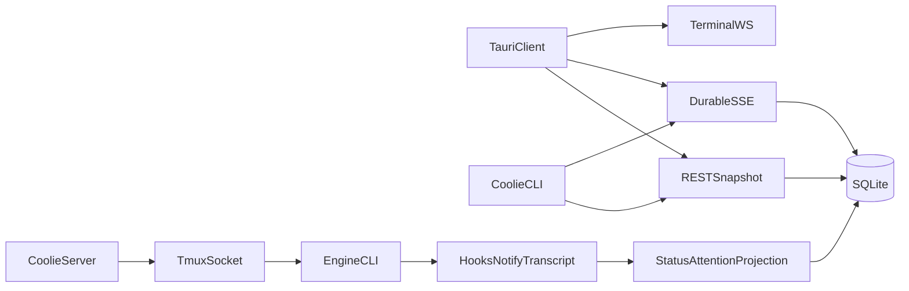

# Coolie 0.1.0 Product Requirements Document

> 日期：2026-07-15  
> 状态：Approved scope / implementation pending  
> 目标平台：macOS 12+  
> 发布形态：可安装的 unsigned `.app` / `.dmg` CI artifact  
> 配套路线图：[`../plans/2026-07-15-coolie-v0.1.0-roadmap.md`](../plans/2026-07-15-coolie-v0.1.0-roadmap.md)
> 架构决策：[`../../architecture-decision-log.md`](../../architecture-decision-log.md)

## 1. 产品定义

Coolie 是一个 local-first 的 macOS AI 开发任务控制台。它把一个开发任务组织成：

```text
Workspace = Project + stable directory + git worktree + branch
          + running environment + engine sessions + review state
```

其中：

- **Workspace 是委派单元**：一个可独立运行、观察、恢复和丢弃的开发任务。
- **Branch / PR 是集成单元**：代码最终通过 branch、PR 或安全 merge-back 回到主代码线。
- **Engine CLI 是执行产品**：Claude Code、Codex、Copilot 负责认证、审批、模型执行和原生 TUI；Coolie 不在 0.1.0 重做完整聊天运行时。
- **Coolie 是控制平面**：负责 worktree、运行环境、会话连接、durable state、review、自动化和注意力路由。

0.1.0 的目标不是复制 Conductor 或 Kobe 的全部功能，而是交付一个可安装、可恢复、可自动化的本地日常开发闭环。

## 2. 背景与基线

### 2.1 对标结论

Conductor 最值得对齐的是本地开发流程：

```text
添加项目
→ 创建隔离 workspace
→ 准备环境
→ 启动 agent / terminal / run scripts
→ 观察状态
→ 阅读 diff 并反馈
→ 创建 PR 或 merge
→ archive / restore
```

Kobe 最值得补齐的是：

- engine-owned structured transcript；
- 内置 Copilot；
- durable attention inbox；
- agent-friendly、自描述的控制接口；
- session/daemon 解耦后的恢复纪律；
- 分层的真实行为、视觉与性能测试。

Coolie 已有且应继续强化的差异化能力：

- SQLite durable events 与 SSE replay；
- 持久 prompt FIFO；
- checkpoint 私有 git refs；
- 行级 diff 评论写回 composer；
- 安全附件上传；
- 确定性 `git push` / `gh pr create` / merge-back；
- REST、Unix socket、terminal WS 和 CLI 自动化面；
- Tauri 桌面、deep link、中英文 UI；现有 Web build 不作为 0.1.0 产品面或发布门禁。

### 2.2 当前实现不是待办清单

以下能力已经存在，0.1.0 任务是补齐产品化、正确性或发行闭环：

- Project、main task、lazy workspace intent。
- Managed / adopted worktree 生命周期。
- `.worktreeinclude` 与缺省 `.env*` 复制。
- setup / init scripts 与每 workspace 10 个端口。
- tmux 持久 engine/setup/shell tabs。
- Claude、Codex 和 custom engine。
- queue、interrupt、resume、hooks/notify/mtime 状态。
- Files/Changes、单文件 diff、附件、PR、merge-back。
- command palette、keybindings、theme、i18n、通知。

旧 M1/M2 文档是历史计划；本 PRD 是 0.1.0 的前向范围与验收真源。

## 3. 用户与核心场景

### 3.1 目标用户

- 在一台 Mac 上同时推进多个 coding-agent 任务的个人开发者。
- 希望保留真实 Claude/Codex/Copilot CLI 行为，而不是切换到厂商无关聊天壳的用户。
- 需要 review、PR、自动化、可恢复环境，而不仅是开多个终端的用户。
- 使用本地 repo、私有凭据、依赖缓存和服务环境，不希望代码上传到 Coolie 云端的用户。

### 3.2 非目标用户

- 需要多人实时协作、组织权限、云 workspace 或集中计费的团队。
- 需要 Coolie 托管模型账号或远程执行基础设施的用户。
- 需要完整替代 Claude Code/Codex 原生审批和聊天 UI 的用户。

## 4. 0.1.0 北极星验收旅程

用户首次安装 Coolie 后，无需 Coolie 账号或 GitHub 登录，即可：

1. 打开本地 git repository。
2. 在 Dispatcher 输入任务，选择 base branch、engine、model 和 effort。
3. 创建不改变主 checkout 的稳定 worktree 和独立 branch。
4. 自动复制允许的 gitignored 环境文件，包括缺省 `.env*`。
5. 运行可见的 setup，并按 project 配置启动 run script。
6. 在真实 engine TUI 中工作，也可切换只读 structured transcript。
7. 关闭并重新打开 App，继续同一 tmux/engine session。
8. 在 sidebar 和 Inbox 中看到 working、waiting、error、done 及具体 tab。
9. 阅读 against-base diff，把行级评论发回 agent，并运行 Agent Review。
10. 在 Checks 中确认本地状态、run/test 和可用的 PR/CI 状态。
11. 创建 PR，或在安全守卫下 merge-back。
12. Archive workspace，并可从 branch、session metadata 和 transcript 恢复。

如果没有 `gh` 登录，步骤 1–10、12 必须正常；PR 操作显示可执行的登录提示。

## 5. 版本范围

| 能力 | 当前状态 | 0.1.0 要求 |
|---|---|---|
| Project / Workspace 生命周期 | 已实现 | 修复半状态；补阶段进度和发布级 E2E |
| `.worktreeinclude` / `.env*` | 已实现基础复制 | 完整语义、设置、预览、安全、manifest |
| setup / init | 已实现 | 加 run/archive scripts、日志、重跑和统一 env |
| Claude / Codex | 已实现 | structured transcript 与能力契约 |
| Copilot | custom preset | 升级为保守能力的 built-in adapter |
| Attention | client memory Set | durable Inbox，跨客户端/重启一致 |
| Agent API | REST/CLI/SSE 已有 | `/state + asOfSeq`、typed schema、wait、幂等 |
| Terminal | tmux/xterm 已实现 | reconnect 修复、真实 UI 验收 |
| Diff / 评论 | 已实现主体 | against-base/review/checks 日常闭环 |
| PR / merge-back | 已实现 | 状态反馈、finish→archive 明确流程 |
| UI 自动化 | 无桌面 E2E | WebdriverIO Tauri：mock daemon + real daemon/tmux |
| macOS artifact | 开发 checkout 才可启动 server | 无 checkout/node_modules 可自举 |

## 6. 功能需求

### FR-1 Onboarding 与 Project

#### FR-1.1 无账号启动

- 不要求 Coolie 账号。
- 启动时检查 `git`、`tmux` 和至少一个可用 engine。
- `gh`、通知权限和外部 editor 是渐进增强，不阻断本地循环。
- 缺依赖时显示检测结果、安装提示和 Recheck。

#### FR-1.2 添加 Project

- 支持选择本地 repo 和 URL clone。
- 注册后创建钉在 root checkout 的 main task。
- Sidebar 按 Project → Workspace 分组，支持折叠、搜索、pin 和状态过滤。
- Project 保存 repo root、默认 base branch 和本机设置。

#### FR-1.3 移除 Project

- Forget project 不删除用户 repository。
- 有普通 workspace 时默认拒绝 forget，并说明处理方法。
- main task 不可按普通 task 删除。

### FR-2 Dispatcher 与 Workspace 创建

#### FR-2.1 输入

Dispatcher 至少提供：

- Project；
- base branch；
- engine；
- model；
- effort；
- 首条 prompt；
- 可选 workspace display name / stable directory name。

#### FR-2.2 创建阶段

UI 必须显示以下阶段及错误来源：

1. resolve/fetch base；
2. create branch/worktree；
3. copy ignored files；
4. setup/init；
5. create tmux/session/tabs；
6. launch engine；
7. deliver first prompt。

任一步失败：

- 不留下未登记 worktree、orphan tmux window 或伪 active row；
- 记录 typed failure；
- Retry 从持久化 intent 继续；
- Delete 清理可证明属于 Coolie 的半成品。

#### FR-2.3 命名

- directory name 创建后稳定，修改 display title/branch 不移动目录。
- branch name 表达任务语义，可独立安全改名。
- 同一 branch 已被其他 worktree checkout 时，返回明确冲突，不覆盖或 detach。

### FR-3 Worktree 隔离环境

#### FR-3.1 Files to copy 配置

优先级固定为：

1. repo root `.worktreeinclude`；
2. 本机 Project Settings 中的 Files to copy；
3. 内置默认 `.env*`。

当 `.worktreeinclude` 存在时，它完整替代后两层；空文件表示“不复制任何额外文件”，不能回退 `.env*`。

语法采用 gitignore 语义：

- comments、blank lines；
- root-relative 与 nested patterns；
- directory patterns；
- `!` negation；
- last matching rule wins。

#### FR-3.2 复制资格

只有同时满足以下条件的文件可复制：

- 存在于主 checkout；
- Git 判定为 ignored；
- 未被 tracking；
- 是普通文件；
- realpath 位于 repo root 内；
- 目标路径位于 workspace root 内。

不得复制：

- tracked files；
- 普通 untracked 但未 ignored 的文件；
- symlink、socket、device；
- `node_modules` 和常见 build output，除非未来显式解除硬保护；
- 超过安全上限的集合。

初始安全上限：

- 最多 1,000 个文件；
- 总大小最多 100 MiB；
- 单文件最多 20 MiB。

超过上限时停止并显示候选统计，不进行部分静默复制。

#### FR-3.3 时机与覆盖

- 首次 provision/retry 时，在 worktree add 之后、setup 之前复制。
- 普通 enter、App restart、tmux reconnect 不重新复制，避免覆盖 workspace 内修改后的 `.env`。
- Project Settings 提供 Preview。
- 显式 Copy again 必须展示新增/覆盖/缺失列表；覆盖需要确认。

#### FR-3.4 Manifest 与安全

- 保存复制 manifest：relative path、size、mtime、copy timestamp、规则来源。
- manifest 不保存文件内容或 secret hash。
- event/log 只写计数、路径和错误，不写内容。
- 单文件采用临时文件 + rename，保留 POSIX mode。
- copy 阶段失败触发 workspace provision 回滚。

#### FR-3.5 统一环境变量

engine、setup、run、archive 和 shell 统一获得：

```text
COOLIE_WORKSPACE=<workspace id>
COOLIE_WORKSPACE_NAME=<stable name>
COOLIE_WORKSPACE_PATH=<absolute worktree path>
COOLIE_ROOT_PATH=<source checkout path>
COOLIE_DEFAULT_BRANCH=<base branch>
COOLIE_PORT=<first allocated port>
COOLIE_PORT_0..9=<allocated ports>
COOLIE_IS_LOCAL=1
```

静态 secret 文件使用 Files to copy；依赖安装、生成配置、symlink、密码管理器或云 secret fetch 使用 setup。

### FR-4 Running Environment

#### FR-4.1 Scripts

每个 Project 支持：

- setup script：provision 时执行，可手动重跑；
- named run scripts：启动 app/server/test watcher；
- archive script：archive 前清理 workspace 外部资源。

配置来源：

- repo shared `.coolie/` 文件；
- `~/.coolie/projects/<projectId>/` 本机 override；
- repo root local overlay（git-excluded）。

#### FR-4.2 Run 管理

- Run 控件显示脚本名、running/exited/error 和最近日志。
- 多个命名 run scripts 可并行；每个 script 同一时刻只有一个实例。
- Stop 先发送 `SIGHUP`，等待 200ms，仍存活则终止整个进程组。
- App/daemon 重启后从实际进程状态收敛，不凭 UI memory 猜测。

#### FR-4.3 日志

- setup/run/archive 有独立、bounded 日志。
- 可从 workspace UI 打开、重跑和复制错误摘要。
- 日志不得输出 API bearer token 或 Files-to-copy 内容。

### FR-5 Engine 与 Session

#### FR-5.1 Engine Registry

0.1.0 built-in engines：

- Claude Code；
- Codex；
- GitHub Copilot。

Custom engine 继续支持，但不能覆盖 built-in reserved ids。

所有 UI 数据来自 engine registry：

- identity；
- availability；
- models/efforts；
- queue/resume/hooks/transcript 等 capabilities；
- launch、history、turn detection 和 terminal-title policy。

#### FR-5.2 内置 Copilot

初始能力保守：

```text
nativeQueue=false
midSessionModelSwitch=false
resume=false
hooks=false
effort=false
transcript=none
```

- 使用 Copilot executable 自身做 version probe。
- 使用 GitHub auth 做独立 account probe。
- 不因命令可能存在而宣称 capability。
- 真实 CLI 版本冒烟通过后，能力逐项开启。

兼容迁移：

- 旧 `presetId=copilot,id=copilot` row 迁移到 built-in。
- 用户手写的 `id=copilot` custom engine 无损改名并同步 tab 引用。
- 旧 preset endpoint 保留一个兼容周期并返回 deprecation。

#### FR-5.3 Structured Transcript

Engine adapter 输出统一只读模型：

```text
TranscriptEntry
  id, role, timestamp?, turnId?, rawType
  blocks[]

TranscriptBlock
  text | thinking | tool-call | tool-result | image | unknown
```

要求：

- Claude/Codex parser 隐藏 vendor JSONL schema。
- API 不暴露 transcript 绝对路径。
- 坏 JSONL、未知 row 或半写入不能使整页失败。
- 使用 opaque byte cursor，不允许每次读取整个大文件。
- 文件 truncate、replace 或 session switch 返回 `reset=true`。
- 同时限制 entry count 与 response bytes。
- archived workspace 在 transcript 仍存在时可读。

UI：

- engine tab 提供 `Transcript | Terminal`。
- structured transcript 缺能力或读取失败时，Terminal 仍是完整逃生舱。
- Transcript 是只读视图，Composer 仍发送到原生 engine TUI。
- text/tool arguments 按纯文本安全渲染，不使用未消毒 HTML。

### FR-6 Prompt、Queue 与幂等

- 保留 engine capability 驱动的 native queue / SQLite queue 分流。
- 服务端 queue 明确为 **at-least-once**。
- `POST input` 和 CLI `send` 接受 idempotency key。
- 同 workspace、同 key、同 request 返回首次结果。
- 同 key、不同 request 返回 409。
- receipt 有长度、保存期限和 cleanup。
- interrupt、send、interrupt-send 的结果可由 API/CLI 结构化观察。

### FR-7 Durable Attention Inbox

#### FR-7.1 Attention item

每个 attention episode 至少包含：

- id；
- workspaceId；
- tabId；
- kind：turn-finished / permission / elicitation / rate-limit / error / inferred；
- source：hook / notify / transcript poller；
- source event seq；
- session/turn identity（可用时）；
- summary；
- open / acknowledged；
- createdAt / acknowledgedAt。

#### FR-7.2 一致性

turn completion 写入必须在一个数据库事务中完成：

1. 更新 tab current status；
2. append current event；
3. insert attention item。

commit 后再 broadcast。

- 重复 hook/notify 不创建重复 episode。
- mtime 推断项标记 `inferred`。
- 同 tab 新 turn 不能被旧 acknowledge 误清。
- workspace hard delete 级联清理；archive 保留未处理项并标注 archived。

#### FR-7.3 UI / CLI

- Sidebar 显示 unread count。
- Inbox 可按 project/workspace/kind 过滤。
- “Next attention”精确跳到 workspace + tab。
- 只有目标 tab 可见且 App focused 时才自动 acknowledge。
- bootstrap 恢复的旧 item 不重新触发 OS notification。
- CLI 支持 list/get/ack。

### FR-8 Agent-friendly API

#### FR-8.1 Snapshot + Event Stream

新增 current-state snapshot：

```text
GET /state
GET /state?workspace=<id>

CoolieStateSnapshot
  asOfSeq
  generatedAt
  projects[]
  workspaces[]
  tabs[]
  openAttention[]
  queuedPrompts[]
  activeRuns[]
```

读取流程必须在一个 SQLite read transaction 内：

1. 读取当前 `MAX(events.seq)`；
2. 读取 canonical current tables；
3. 返回 `asOfSeq`。

消费者流程：

```text
snapshot GET /state → asOfSeq=N
events stream after=N → live increments
```

不得用通用 `latest_event` 或 last-value channel 替代 canonical state。

#### FR-8.2 自描述接口

每个 route/verb 明确：

- stable name/group；
- method/path；
- request/response DTO；
- required/optional fields；
- enum；
- errors；
- side effects；
- idempotency；
- example。

禁止仅从 description 正则推导 request shape。Schema 与真实 handler 必须有 contract test。

#### FR-8.3 CLI

新增或完善：

```text
coolie state [workspace] --json
coolie inbox list [--workspace]
coolie inbox ack <id...>
coolie transcript <workspace> --tab <id> [--follow] [--json]
coolie wait <workspace> --for attention|idle|error --timeout <duration>
coolie send <workspace> --idempotency-key <key> ...
```

所有 agent-facing command：

- stdout 只输出结构化结果；
- stderr 输出结构化或单行可操作错误；
- 部分成功不能丢失已创建 task ids；
- exit code 稳定；
- daemon 不可用时给 doctor/log 下一步。

### FR-9 Terminal 与 Composer

- engine/setup/shell tab 可创建、切换、重命名和关闭。
- App/daemon restart 不杀 tmux engine。
- Resume/reconnect 前必须关闭旧 WebSocket，禁止同 xterm 双写。
- resize、Unicode、中文 IME、copy/paste、Ctrl chords 有真实 UI 验收。
- engine 退出显示 exit 状态、Resume 和 shell fallback。
- queue 可查看、撤回；model/effort 在 GUI 与 CLI 一致。

### FR-10 Files、Review 与 Checks

#### FR-10.1 Changes

- against-base 是 task review 的默认范围。
- 支持 staged、unstaged、untracked 分区。
- untracked 文本文件提供内容 diff；二进制显示 metadata。
- 文件树、diffstat、filter 和文件间导航。
- 可在外部 editor 打开文件/worktree。
- 大 repo 有 loading、timeout、bounded concurrency 和 stale result guard。

#### FR-10.2 评论与 Agent Review

- 单行/多行 comment 可写回 composer。
- comment 保留 file、line range、diff side 和文本。
- Agent Review 使用 project review prompt，默认新建或复用明确的 review tab。
- Review 结果进入 transcript/attention，不隐藏在一次性 toast。

#### FR-10.3 Checks

0.1.0 局部 Checks 聚合：

- git clean/dirty/conflict；
- base/head；
- run/test script 最近结果；
- PR URL/title/lifecycle；
- GitHub CI/check state（`gh` 可用时）；
- 未发送的本地 diff comments。

不包含：

- GitHub review comments 双向同步；
- deployments；
- Linear/Graphite/Vercel；
- 团队 todos/approval policy。

### FR-11 PR、Merge 与 Archive

- Create PR 使用 argv-only `git push` 和 `gh pr create`。
- `gh` 缺失/未登录/网络失败提供分类错误。
- Open in GitHub。
- merge-back 拒绝 dirty main checkout；冲突保留现场，不 reset。
- Finish 成功后明确提供 Archive，不做隐式破坏性清理。

Archive：

- 引入持久 `archiving` 中间态或等价可恢复状态机。
- freeze 新输入后做最终 dirty check。
- archive script、session teardown、worktree remove 和状态提交可重试。
- 失败时恢复 runtime，或保留明确可继续的中间态。
- adopted worktree 永不由 Coolie 删除。
- restore 从 branch 重建并恢复 engine metadata/transcript 引用。

### FR-12 Settings

0.1.0 设置：

- General：startup、send、notification、sound；
- Engines：availability、binary、default model/effort、custom engine；
- Appearance：system/light/dark、language；
- Terminal：shell、scrollback、external terminal/editor；
- Keybindings；
- Project：base branch、Files to copy、setup/run/archive、review/PR prompts。

设置 UI 必须标注存储 scope：

- application local；
- project local；
- repository shared。

0.1.0 不做 enterprise managed settings。

## 7. 架构契约

### 7.1 总体数据流



### 7.2 Deep modules

#### WorktreeEnvironment

小接口隐藏 pattern resolution、Git ignored enumeration、security policy、copy 和 manifest：

```ts
interface WorktreeEnvironment {
  preview(projectId: string): Effect<CopyPlan, CopyError>
  apply(workspaceId: string, mode: "provision" | "explicit-recopy"): Effect<CopyResult, CopyError>
}
```

调用方不解析 `.worktreeinclude`，不自行复制。

#### TranscriptReader

```ts
interface TranscriptReader {
  read(context: TranscriptContext, cursor?: string): Effect<TranscriptPage, TranscriptError>
}
```

vendor adapters 是内部 seam；HTTP/UI 只见统一 DTO。

#### AttentionInbox

```ts
interface AttentionInbox {
  record(signal: CompletionSignal): Effect<AttentionItem>
  list(filter: AttentionFilter): Effect<AttentionItem[]>
  acknowledge(id: string, expectedEpisode?: string): Effect<AttentionItem>
}
```

record 与 tab/event 写入通过 repository transaction 组合。

#### StateSnapshot

```ts
interface StateSnapshot {
  read(scope?: { workspaceId?: string }): Effect<CoolieStateSnapshot>
}
```

snapshot 是 current state 接口，events 是 audit/incremental 接口；两者职责不得混合。

#### RunManager

```ts
interface RunManager {
  start(workspaceId: string, runId: string): Effect<RunState, RunError>
  stop(workspaceId: string, runId: string): Effect<RunState, RunError>
  reconcile(workspaceId: string): Effect<RunState[]>
}
```

进程 ownership、日志和 cleanup 隐藏在实现内。

## 8. 自动化 UI 测试

0.1.0 不建立 Web UI gate，不把 Web client 扩展或发布作为版本目标。自动化直接验证目标产品 Tauri。

### 8.1 三层体系

1. Vitest：pure state、parser、repository、HTTP contract。
2. WebdriverIO Tauri embedded provider + mock daemon：主力 React/CSS/keyboard/error journey。
3. WebdriverIO Tauri embedded provider + real isolated daemon/tmux：关键桌面闭环与原生契约。

WebDriver plugins 只进入 test binary/config；release binary 不加载自动化 server。

### 8.2 Isolation fixture

每个 real worker 使用：

```text
COOLIE_HOME=<tmp>/home
COOLIE_WORKSPACES_ROOT=<tmp>/workspaces
COOLIE_REPOS_ROOT=<tmp>/repos
COOLIE_TMUX_SOCKET=coolie-ui-<worker>-<nonce>
COOLIE_CLAUDE_HOME=<tmp>/claude
COOLIE_CODEX_HOME=<tmp>/codex
COOLIE_CLAUDE_CONFIG=<tmp>/claude.json
COOLIE_CODEX_CONFIG=<tmp>/codex.toml
```

- fake engine，不调用真实账号；
- 独立 git repo、author、date、branch；
- teardown：Tauri window/SSE/WS → `/shutdown` → process-group fallback → test tmux kill-server → temp cleanup；
- 禁止默认 `~/.coolie`、`tmux -L coolie` 和真实 engine home。

### 8.3 Blocking UI journeys

Mock daemon：

1. Tauri test app 连接隔离 mock daemon。
2. Empty state → add project → Dispatcher。
3. Workspace/sidebar/terminal/composer。
4. send/queue/attention/diff 更新。
5. offline → reconnect → replay。
6. archive conflict/force/restore。
7. settings/theme/i18n/keybindings。
8. transcript/terminal toggle。
9. Copilot availability/error。

Real daemon/tmux：

1. create → `.env*` copy → setup → fake engine。
2. terminal binary I/O、resize、reconnect。
3. hook/notify → durable Inbox → ack。
4. diff comment → composer → input。
5. daemon restart → snapshot/SSE/session restore。
6. archive/restore。

Tauri-only：

1. packaged sidecar auto-start。
2. directory dialog。
3. deep link。
4. editor/terminal IPC allowlist。
5. window controls。

### 8.4 桌面视觉与结构验收

- macOS Tauri 是唯一 UI 自动化平台。
- blocking gate 使用 role/name、focus、layout bounds 和关键文本断言，不使用跨机器脆弱的全屏像素比较。
- 固定 1440×900、locale、timezone、theme，并关闭 animation/transition。
- light/dark 的 sidebar、Dispatcher、Transcript、Diff、Inbox、Settings 截图作为失败诊断 artifact。
- xterm 只断言连接、文本、输入和 resize；透明窗口/vibrancy 截图不作为 blocking baseline。

## 9. 发行与安全

### 9.1 macOS artifact

0.1.0 CI 产出：

- unsigned `.app`；
- unsigned `.dmg`；
- checksum；
- test/build metadata。

artifact 在没有源码 checkout、`node_modules` 或全局 `tsx` 的干净环境中：

- 可启动 bundled server；
- 可找到 bundled resources/native addons；
- 可完成北极星 journey；
- uninstall 不删除用户 worktrees/branches。

sidecar 方案在实现前做 timeboxed ADR：

- bundling Node runtime + compiled JS/resources/native addons；
- 可验证的 standalone Node packaging。

不得用 Bun runtime 运行依赖 `node-pty` 的 server。

### 9.2 Tauri 安全

- 启用 CSP。
- `spawn_detached` 改成专用、allowlisted commands。
- Bearer token 保持 0600、timing-safe compare。
- 仅 loopback listen。
- WebDriver plugins 只编入 test binary，release capability 不包含它们。
- renderer XSS 不得直接升级为任意本机进程执行。

### 9.3 明示无沙箱

Coolie 和 engine 以用户权限运行，0.1.0 不提供 sandbox。Onboarding、README 和 Settings 必须明确：

- engine 能读取当前用户可访问的数据；
- tool approvals 属于 engine；
- custom engine 和 token 等同本机执行能力；
- 不信任的 repo 应在 VM/独立账号中运行。

## 10. 非功能要求

### NFR-1 可靠性

- App/daemon restart 不杀 engine。
- state snapshot + SSE 无丢失窗口。
- attention 和 queue 跨 restart。
- archive/restore、copy、run start/stop 幂等或可重试。
- 无静默半成功。

### NFR-2 性能

- App 首屏不等待 transcript 全量解析。
- transcript 分页与响应 bytes 双上限。
- collector、diff 和 file copy bounded concurrency + in-flight dedupe。
- hidden workspace 不持有不必要 terminal connection。

### NFR-3 隐私

- 无 Coolie cloud telemetry。
- transcript、prompt、diff、secret 文件不上传。
- event/log 不记录 attachment 或 `.env` 内容。
- 0.1.0 不扩展、不发布 Web client；现有 Web build 不进入 release gate。

### NFR-4 可访问性

- 核心 UI 可 keyboard-only。
- dialog 有 focus trap 和 Escape。
- 交互元素有 role/name；`data-testid` 仅作无法语义定位时的后备。
- 状态不只依赖颜色。

### NFR-5 兼容性

- macOS 12+。
- zsh/bash 用户环境。
- Git worktree。
- tmux 独立 socket。
- Claude/Codex/Copilot capability 由探测结果决定，不按版本想当然。

## 11. 发布门禁

每个 PR blocking：

- TypeScript typecheck；
- Rust tests；
- fast Vitest；
- socket/tmux serial tests；
- macOS WebdriverIO Tauri mock-daemon journeys；
- macOS WebdriverIO Tauri real-daemon P0 smoke；
- path/file-size/schema/route contract checks。

Release blocking：

- 上述全部；
- macOS WebdriverIO Tauri smoke；
- `.app/.dmg` artifact build；
- clean-environment sidecar smoke；
- north-star journey；
- real user `~/.coolie`、`~/.claude`、`~/.codex` 零污染检查。

## 12. Definition of Done

0.1.0 只有在以下条件全部满足时完成：

- 北极星 12 步自动化或明确分层验收通过。
- artifact 不依赖开发 checkout。
- Project/Workspace/Worktree 生命周期无已知半状态 P1。
- `.env*` 缺省复制和 `.worktreeinclude` 完整语义通过 real git E2E。
- setup/run/archive 与统一环境变量可观察、可停止、可重跑。
- Claude/Codex structured transcript 可读；Terminal fallback 始终可用。
- Copilot 是 built-in，且只声明实证能力。
- Inbox 跨 daemon/App restart 保留且 ack 幂等。
- agent 可用 snapshot + event cursor、wait 和 idempotent send 驱动 Coolie。
- diff comment→agent、Review、Checks、PR/merge、archive/restore 形成闭环。
- CSP、command allowlist、路径防逃逸和 secret redaction 生效。
- 所有 blocking CI 绿。

## 13. 明确排除

0.1.0 不包含：

- Coolie Cloud 或 remote execution；
- Web 产品扩展、Web 发布目标和 Playwright Web UI gate；
- 团队账号、assignee、watcher、权限；
- enterprise managed settings；
- Linear、Graphite、Vercel、GitHub Enterprise；
- GitHub review comments 双向同步；
- 完整自渲染 Claude/Codex chat、tool approval、plan approval；
- Hosted PTY 重写；
- 自动下载/托管所有 engine binaries；
- Windows/Linux 桌面发行；
- 签名、公证和公开下载站；
- 语音输入、城市 Passport 等游戏化能力。

## 14. 后续候选

- 签名、公证和自动更新。
- GitHub Issue/PR import。
- review comments 双向同步。
- checkpoint restore / turn rewind。
- Notes / `.context` UI。
- fork workspace。
- Spotlight testing。
- remote SSH execution。
- Hosted PTY，仅在 tmux/terminal 指标证明迁移价值后立项。

